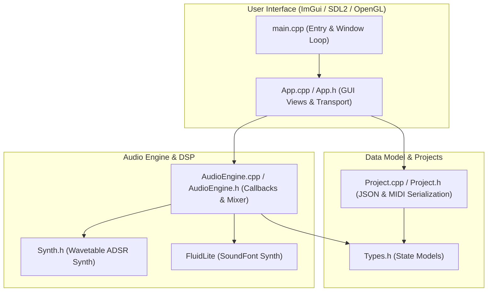

# neoDAW Project Context & Architecture

This document provides a clean, structured overview of the **neoDAW** codebase architecture, local modifications, and environment history. It is designed to quickly onboard other developers or AI assistants to the project.

---

## 🎵 What is neoDAW?
**neoDAW** is a real-time, lightweight Digital Audio Workstation (DAW) built with C++20. It features:
* **Audio Synthesis:** A custom wavetable synthesizer and a real-time **FluidLite** SoundFont (`.sf2`) playback engine.
* **Sequencing:** A 16-step grid sequencer, multi-track playlist arranger, and high-resolution piano roll note editor.
* **Mixing & Effects:** An 8-channel mixer featuring per-channel volume, panning, mute/solo controls, and custom stereo feedback delays.

---

## 🏛️ Codebase Architecture

### File Reference Table

| Component | Source Files | Description |
| :--- | :--- | :--- |
| **App Entry & Platform** | [main.cpp](file:///c:/Code/Neow/neoDAW/src/main.cpp) | Initializes SDL2, OpenGL 3.3, and Dear ImGui. Executes the frame loop, handles window resizing, and invokes native file dialogs. |
| **UI & State Logic** | [App.h](file:///c:/Code/Neow/neoDAW/src/App.h) [App.cpp](file:///c:/Code/Neow/neoDAW/src/App.cpp) | Handles panels (Channel Rack, Piano Roll, Playlist, Mixer, Browser) and state tracking (undo/redo stacks, scroll offsets, drag actions). |
| **Audio Routing & DSP** | [AudioEngine.h](file:///c:/Code/Neow/neoDAW/src/AudioEngine.h) [AudioEngine.cpp](file:///c:/Code/Neow/neoDAW/src/AudioEngine.cpp) | Implements the SDL2 audio callback, real-time mix busses, FluidLite SoundFont wrappers, and stereo delay lines. |
| **Wavetable Engine** | [Synth.h](file:///c:/Code/Neow/neoDAW/src/Synth.h) | A header-only custom synthesizer generating standard waveforms (Sine, Saw, Square, Triangle, Noise) with an ADSR envelope. |
| **Project & Serialization** | [Project.h](file:///c:/Code/Neow/neoDAW/src/Project.h) [Project.cpp](file:///c:/Code/Neow/neoDAW/src/Project.cpp) | Handles JSON serialization for saving/loading `.neodaw` files and imports/exports standard MIDI files. |
| **Data Types** | [Types.h](file:///c:/Code/Neow/neoDAW/src/Types.h) | Holds core DAW structures (`Note`, `Channel`, `Pattern`, `MixerSlot`, `PlaylistClip`, `TransportState`). |

---

## 🛠️ Active Local Modifications

The workspace currently contains uncommitted changes implementing the following features:

* **Stereo Feedback Delay & Ping-Pong Mode:** Added controls to [MixerSlot](file:///c:/Code/Neow/neoDAW/src/Types.h#L43-L60) and crossed-feedback delay buffer processing in [AudioEngine](file:///c:/Code/Neow/neoDAW/src/AudioEngine.cpp). Exposes a `P-P` toggle in the Mixer GUI, routing delay feedback between Left and Right lines to bounce reflections.
* **Mixer EQ Filter (LP / HP):** Added a toggleable EQ Filter (Low-Pass or High-Pass) on each mixer slot with sliders for **Cutoff Frequency** (mapped exponentially between 20Hz and 20kHz) and **Resonance**. Slot 0 acts as a global master sweep filter, while slots 1-7 filter the input signals of their respective delay channels.
* **Master & Mixer Slot Limiters:** Programmed brickwall peak limiters (limiting peaks to -0.5 dB with instant attack and smooth envelope release decay) on every mixer slot in [AudioEngine.h](file:///c:/Code/Neow/neoDAW/src/AudioEngine.h). Added a `LIM` button toggle in the Mixer slot channel strips.
* **Sidebar Sample Previews:** Single-clicking any `.wav` sample file in the left sidebar browser plays a clean preview of that sample instantly. Utilizes a dedicated preview voice in the audio engine with linear sample rate interpolation (bypassing master effects).
* **Piano Roll Velocity Editor & Snap Resizing:**
  - Added a visual Velocity editor lane at the bottom of the Piano Roll grid child area, showing vertical bars with clickable drag handles to adjust note dynamic velocities (0-127).
  - Refined note length resizing to anchor to the click-down length and snap to grid increments when snapping is enabled.
* **Step Sequencer Enhancements:** Added a default note key (C5 / 60) for step-sequenced beats and support for toggling individual notes on/off.
* **Serialization Support:** Extended the JSON save/load systems in [Project.h](file:///c:/Code/Neow/neoDAW/src/Project.h) to store delay, filter, and limiter parameters (time, feedback, wet mix, ping-pong state, filter enabled, filter type, cutoff, resonance, and limiter enabled).
* **Dynamic SoundFont Preset Dropdown:** Exposes FluidLite's preset iteration APIs to list instrument patches with bank/program details in a searchable ImGui dropdown, replacing the raw `0-127` slider.
* **Segoe UI Vector Font Integration:** Overhauled main font configurations to load clean system vector fonts (`Segoe UI` / `Arial`) on Windows, replacing retro pixel fonts.
* **Sleek Dark Theme:** Overhauled layout roundings, custom paddings, and charcoal backgrounds with amber highlights.
* **Transport Metronome Click:** Synthesizes beat click audio (1200 Hz downbeat, 800 Hz offbeats, 40ms decay) in [AudioEngine](file:///c:/Code/Neow/neoDAW/src/AudioEngine.cpp) triggered via the `MET` button on the transport bar.

---

## 📜 Session History (July 3, 2026)

> [!NOTE]
> Below is the history of tasks completed during this session to make the workspace buildable, modern, and bug-free.

* **Compiler & Dependency Setup:**
  - Diagnosed VS2022 generator cache mismatch and reconfigured CMake for **Visual Studio 2026 (MSVC 19)**.
  - Configured [CMakeLists.txt](file:///c:/Code/Neow/neoDAW/CMakeLists.txt) to fetch and compile SDL2 (`release-2.30.8`) automatically.
* **Visual & Theme Redesign:**
  - Redesigned the ImGui layout spacings, padding, roundings, and zinc/charcoal dark-mode theme with custom amber synth accent highlights.
  - Implemented dynamic TTF file vector font loading in [main.cpp](file:///c:/Code/Neow/neoDAW/src/main.cpp).
* **Usability & Instrument Upgrades:**
  - Implemented `AudioEngine::getSoundFontPresets` to iterate presets using FluidLite's callback engine.
  - Built an ImGui Combo dropdown selector to view and select patch names. Added multi-bank support for patch loading.
  - Implemented crossed-feedback stereo ping-pong delay routing and added the Mixer GUI toggle.
  - Implemented metronome click rendering (1200Hz downbeat / 800Hz offbeat) and integrated the transport bar toggle.
* **Critical Bug Fixes:**
  - **Thread-Safety Bug Fix:** Wrapped `samples.push_back` operations in [AudioEngine::loadSample](file:///c:/Code/Neow/neoDAW/src/AudioEngine.cpp) with an `audioMutex` lock to prevent memory race conditions and crashes during active playback.
  - **Project Restore Bug Fix:** Fixed a silent bug where loaded projects would play silent because sampler wav files and SoundFonts were not reloaded into the engine. Updated [App::appLoadProject](file:///c:/Code/Neow/neoDAW/src/App.cpp) to automatically clear caches, reload samples, and reinitialize SoundFont patches on project load.

